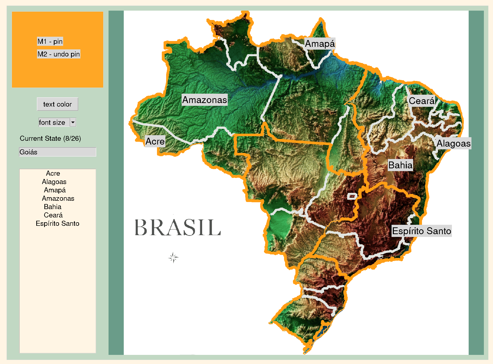

## Build your own country data for the states game

## About
This piece of code can help you mark coordinates on a map 
— to facilitate the states game task proposed in the course ```100 Days of Code: The Complete Python Pro Bootcamp```.
<br>
Before starting, it’s best to define two files to help with the coordinate pinning task.
> - Have a csv file with at least the state names colum. 
> - Have source for confirmation of correct states location

## Installation
With your python enviroment pre installed:

```pip install -r requirements.txt```

## Usage
Simply run the code and follow steps. 

```python build_country_data.py```

Then provide three key informations about your project:

1. Path to the country map file you want to pin<br>
*```e.g: "./my_country_map.png"```*
2. Path to csv file containing all your tates<br>
*```e.g: ./country_data.csv```*
3. Name of the states name column<br>
```e.g: Estado```
4. Follow instructions <br>
    1. Pin coordinate
    2. Unpin coordinate
    3. Edit font

## Example
```bash
Path to country map: ./day_25_us_states_game_start/country_game_data_builder/brasil_topografico.gif 
Path to csv file that contains state names: ./day_25_us_states_game_start/estados_pos.csv
Name of the column with state names: Estado
```



